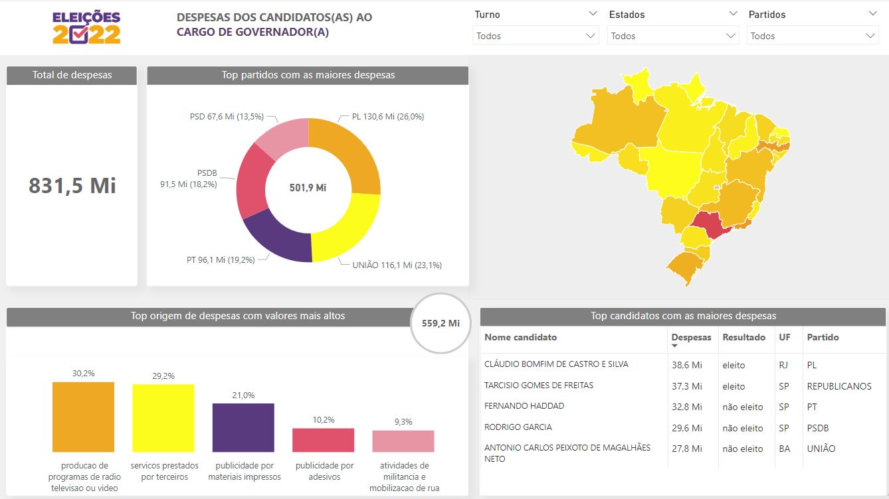

:small_blue_diamond: 🇵🇹
# :small_blue_diamond: **Eleições 2022 - Despesas dos Candidatos para Governador**

Este projeto tem como objetivo realizar uma análise descritiva das despesas realizadas pelos candidatos ao cargo de governador nas eleições de 2022.

---

## 📋 **Objetivo do Projeto**

- Analisar descritivamente as despesas dos candidatos ao cargo de governador nas eleições de 2022.

---

## 📊 **Fonte de Dados**

Os dados utilizados foram tratados pela organização **[Base dos Dados](https://basedosdados.org/)** e disponibilizados pelo **Tribunal Superior Eleitoral (TSE)**.

📁 **Link para acesso à base de dados**: [Clique aqui](https://basedosdados.org/dataset/br-tse-eleicoes?bdm_table=despesas_candidato)

💻 **Consultas SQL realizadas através da ferramenta Google BigQuery.**

---

## 📊 **Dashboard**

A ferramenta **Microsoft Power BI** foi utilizada para:

- **Limpar e tratar os dados.**
- **Criar relacionamentos entre tabelas.**
- **Construir o dashboard interativo.**

### 📌 **O Dashboard Responde:**

- Total de despesas realizadas pelos candidatos ao cargo de governador.
- Os cinco partidos com os maiores valores de despesas.
- As cinco origens de despesas com os maiores valores.
- Os candidatos com os maiores valores de despesas.

Além disso, é possível filtrar informações específicas por **Turno**, **Estado** e **Partido**.

---

### 📊 **Link para o Dashboard**

:bar_chart: Acesse o dashboard interativo clicando no link abaixo:

[**Acesse o Dashboard**](https://app.powerbi.com/view?r=eyJrIjoiZjk0NjBiNTQtOTA4NS00OTM0LTllZDktYTQyMGQxNGRhMTBjIiwidCI6IjA3M2ZmOGM0LWExZDEtNDNiYi1iODNmLWQyNTQ0YmMzODZiMCIsImMiOjh9)

---

## 🖼️ **Prévia do Dashboard**

  

---

🔹 🔹 🔹 🔹 🔹 🔹 🔹 🔹 🔹 🔹 🔹 🔹 🔹 🔹 🔹 🔹 🔹 🔹 🔹 🔹 🔹 🔹 🔹 🔹 🔹 🔹 🔹 🔹 🔹 🔹 🔹 🔹 🔹 🔹 🔹 🔹

# :small_blue_diamond: **Elections 2022 - Expenses of Candidates for Governor**

This project aims to descriptively analyze the expenses incurred by candidates for the position of governor in the 2022 elections.

---

## 📋 **Project Objective**

- Descriptively analyze the expenses of candidates for the position of governor in the 2022 elections.

---

## 📊 **Data Source**

The data used was processed by the organization **[Base dos Dados](https://basedosdados.org/)** and provided by the **Tribunal Superior Eleitoral (TSE)**.

📁 **Link to access the database**: [Click here](https://basedosdados.org/dataset/br-tse-eleicoes?bdm_table=despesas_candidato)

💻 **SQL queries were performed using the Google BigQuery tool.**

---

## 📊 **Dashboard**

The **Microsoft Power BI** tool was used to:

- **Clean and process the data.**
- **Create relationships between tables.**
- **Build the interactive dashboard.**

### 📌 **The Dashboard Answers:**

- Total expenses incurred by candidates for the position of governor.
- The five parties with the highest expenditure amounts.
- The five expense sources with the highest amounts.
- The candidates with the highest expense amounts.

Additionally, it is possible to filter specific information by **Round**, **State**, and **Party**.

---

### 📊 **Link to the Dashboard**

:bar_chart: Access the interactive dashboard by clicking the link below:

[**Access the Dashboard**](https://app.powerbi.com/view?r=eyJrIjoiZjk0NjBiNTQtOTA4NS00OTM0LTllZDktYTQyMGQxNGRhMTBjIiwidCI6IjA3M2ZmOGM0LWExZDEtNDNiYi1iODNmLWQyNTQ0YmMzODZiMCIsImMiOjh9)

---

## 🖼️ **Dashboard Preview**

  

